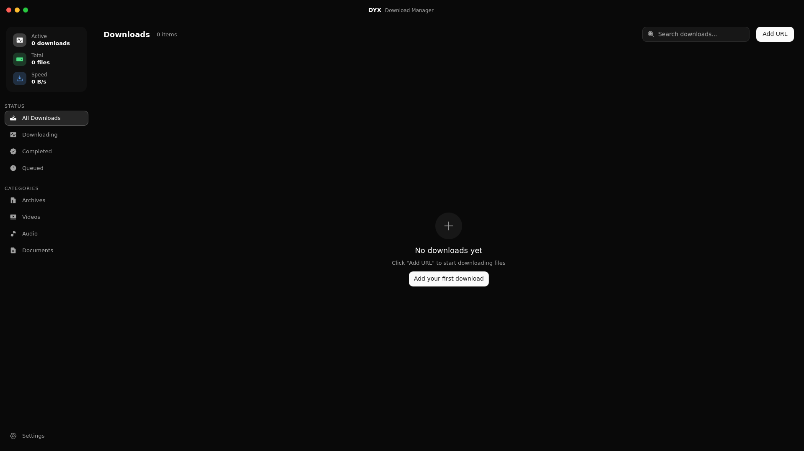
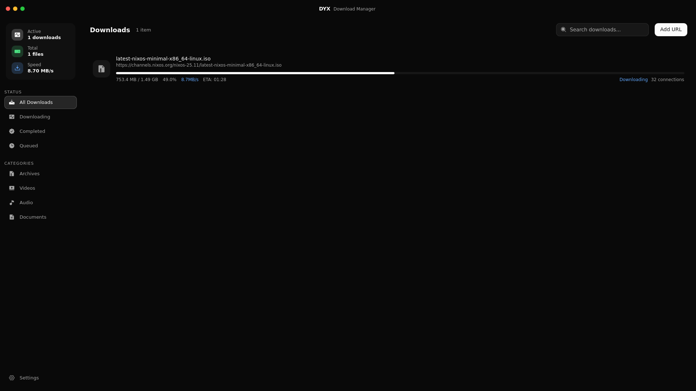
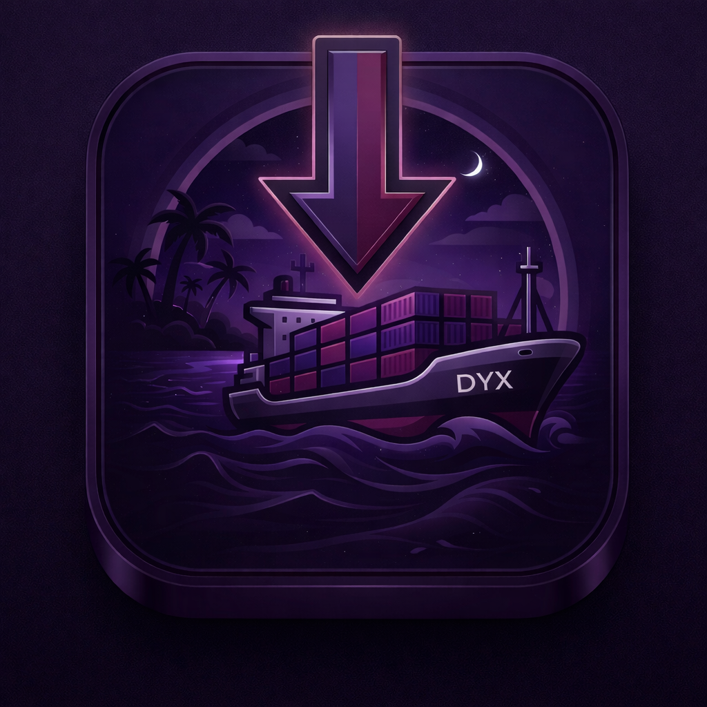

# DYX

`DYX` is a native Linux download manager built on  `axel`.

The mission is simple:

- stop looking like a dead university FTP client
- keep the fast part in `Zig`
- keep the desktop shell in `Qt 6 + QML`
- avoid summoning eleven web stacks for a button that says "Add URL"

## Screenshots





## Icon



## What This Repo Actually Is

- `src/`
  The Zig backend. It talks to `axel`, tracks downloads, saves settings, keeps history, and cleans up partial files without acting like that is a premium feature.
- `qt/`
  The real app UI. Native shell, QML components, backend bridge, all the stuff users actually touch.
- `build.zig`
  Backend build entrypoint.
- `flake.nix`
  The "please just give me a working environment" file.

## Why This Exists

Because too many Linux download managers are either:

- ugly in a hostile way
- abandoned in a spiritual way
- electron apps pretending that 600 MB of RAM is normal behavior

`DYX` is trying to be none of those.

## Run It

The civilized option:

```bash
nix run "path:$PWD"
```

That builds and launches the packaged Qt app with the Zig backend wired up.

## Develop It

Open the dev shell:

```bash
nix develop "path:$PWD"
```

Build the backend:

```bash
zig build backend
```

Run backend tests:

```bash
zig build test
```

Build and run the Qt app:

```bash
cmake -S qt -B build/qt -G Ninja
cmake --build build/qt
./build/qt/dyx-qt
```

## Firefox Extension

Firefox support is native-messaging based, not a localhost hack.

The browser handoff path is:

`Firefox -> dyx-native-host -> dyx-relay -> running DYX`

`DYX` is single-instance now, so browser-triggered downloads get forwarded into the already-running app instead of trying to spin up a second GUI window and pray.

Current dev flow:

```bash
zig build backend
./zig-out/bin/dyx-register-firefox-host
```

Then:

1. Open `about:debugging#/runtime/this-firefox`
2. Click `Load Temporary Add-on...`
3. Pick [manifest.json](/home/soka/projects/DYX/browser/firefox/manifest.json)
4. Start a normal HTTP/HTTPS download in Firefox

If you want to remove the Firefox native host manifest later:

```bash
./zig-out/bin/dyx-unregister-firefox-host
```

## Stack

The stack is blessedly short:

- `Zig`
- `Qt 6`
- `QML`
- `axel`
- `Firefox WebExtension`
- `Nix`

## Current Status

This is alpha, but the good kind of alpha where things already do real work:

- downloads work
- pause/resume works
- delete removes partial files and `.st` sidecars
- settings persist
- history persists
- the Qt shell builds and packages cleanly

## Wayland

Wayland vs X11 is now mostly a Qt problem, which is honestly a huge lifestyle improvement.

## Why Axel

Because `axel` already knows how to download files fast, and reinventing that part from scratch would be a fantastic waste of everyone’s time.
